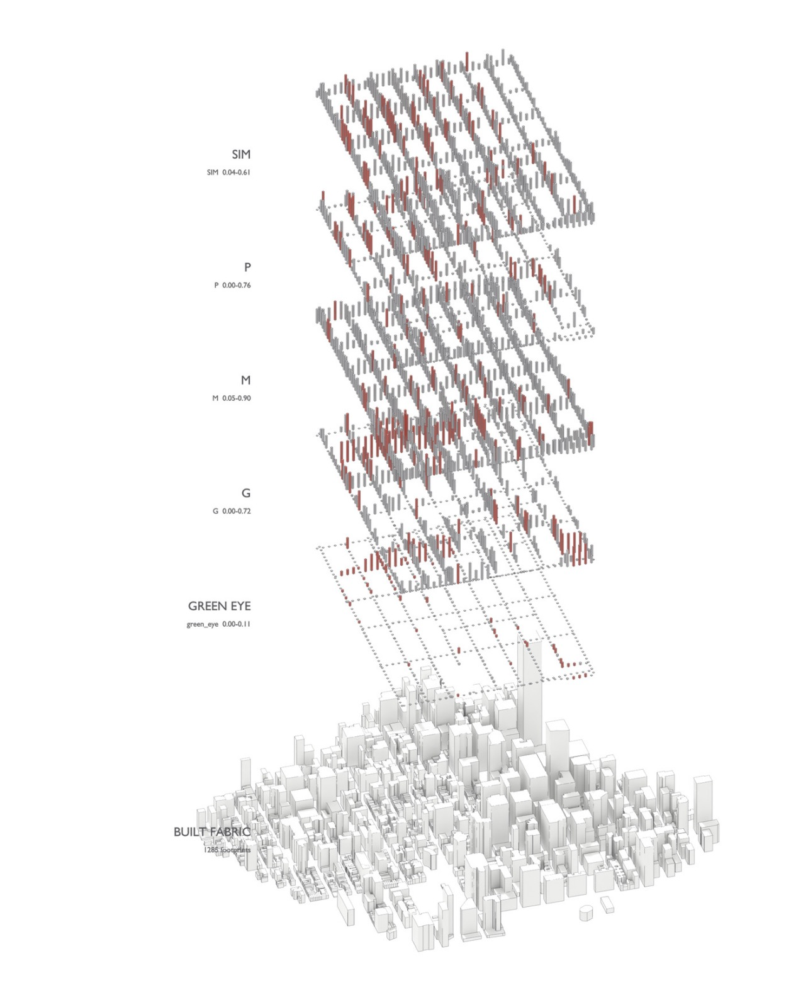

# Figures

## Street Interface Matrix, exploded axonometric

Six strata over the Murray Hill grid, read bottom to top:

| layer | source | range |
|---|---|---|
| **BUILT FABRIC** | 1,285 building footprints, extruded by measured height | — |
| **GREEN EYE** | `green_eye`, eye-level vegetation share | 0.00 – 0.11 |
| **G** | green dimension | 0.00 – 0.72 |
| **M** | morphological dimension | 0.05 – 0.90 |
| **P** | permeability dimension | 0.00 – 0.76 |
| **SIM** | weighted composite, equal thirds of G, M, P | 0.04 – 0.61 |

Every range matches `data/processed/sim_index.csv` exactly, so the drawing is of
the current frame and not an earlier one. Bar height is the value at each 20 m
node; red marks the upper tail.

Note how thin the **GREEN EYE** layer is against the others. Its median share is
0.0009 — under one pixel in a thousand — which is why `tools/sim_dwell.py` passes
the sparse terms through `1 - exp(-x/s0)` before they are weighed against
building at 0.43. The picture is the argument for that transform.

Rendered on macOS from the analysis environment. `sim_index.csv` and
`nodes.gpkg` are all it needs, which is the point of keeping `.venv`
free of GPU dependencies.
